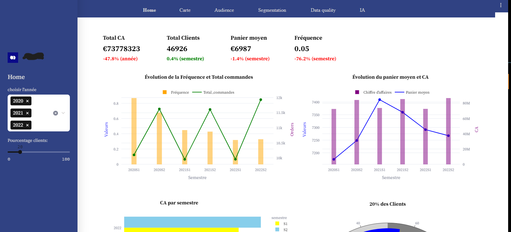
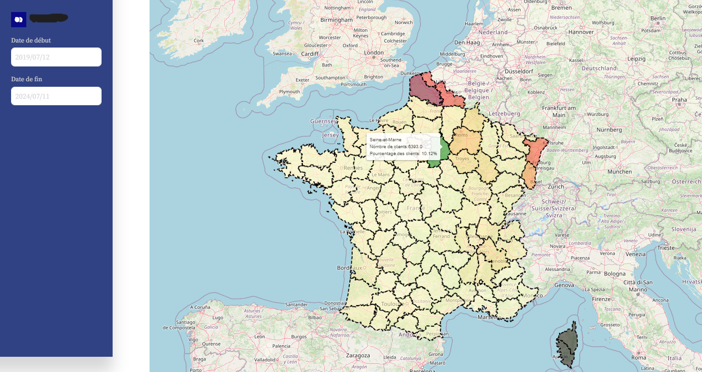
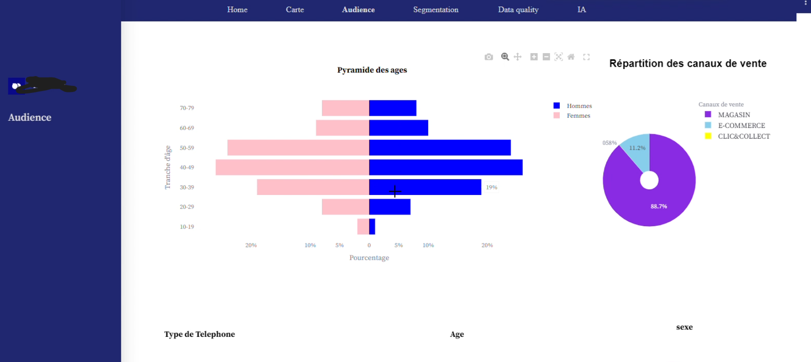
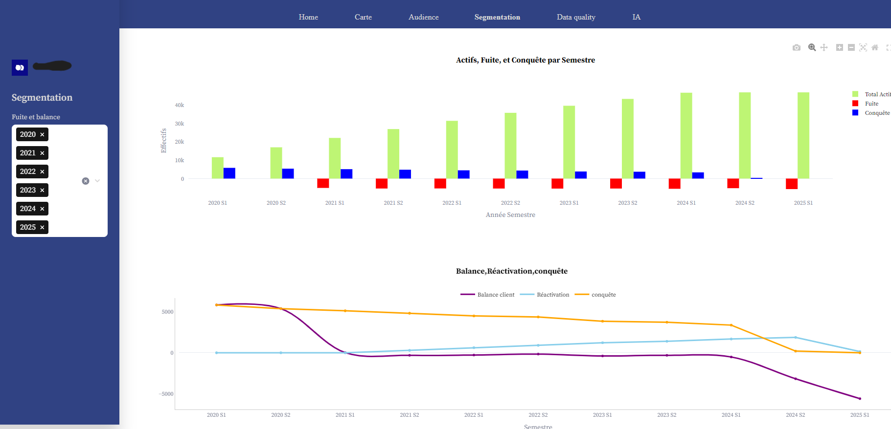
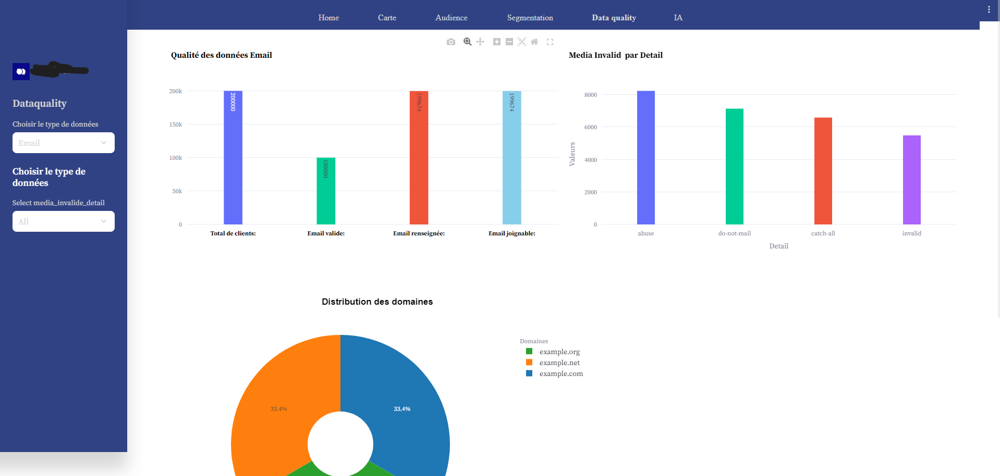

=======
# Streamlit-KPI

Bienvenue dans le projet **Streamlit KPI Dashboard** !

Ce projet utilise **Streamlit** pour créer un tableau de bord interactif permettant de visualiser des **indicateurs clés de performance (KPI)** . Il est conçu pour aider les les clients **(E-commerce)** afin de visualiser leurs résultats de business d'une maniére dyanmique en temps réel .

## Fonctionnalités

l'interface contient 

- Onglet Home :  affichant les principaux graphiques de performance

- Onglet Carte: visualise  distribution des clients sur la carte de france

- Onglet Audience: Affiche  differentes distributions de données

- Onglet Segmentation : Contient des graphiques pour analyser les différents segments des clients.

- Onglet Data quality : visualisant l'état et la qualité de données 

